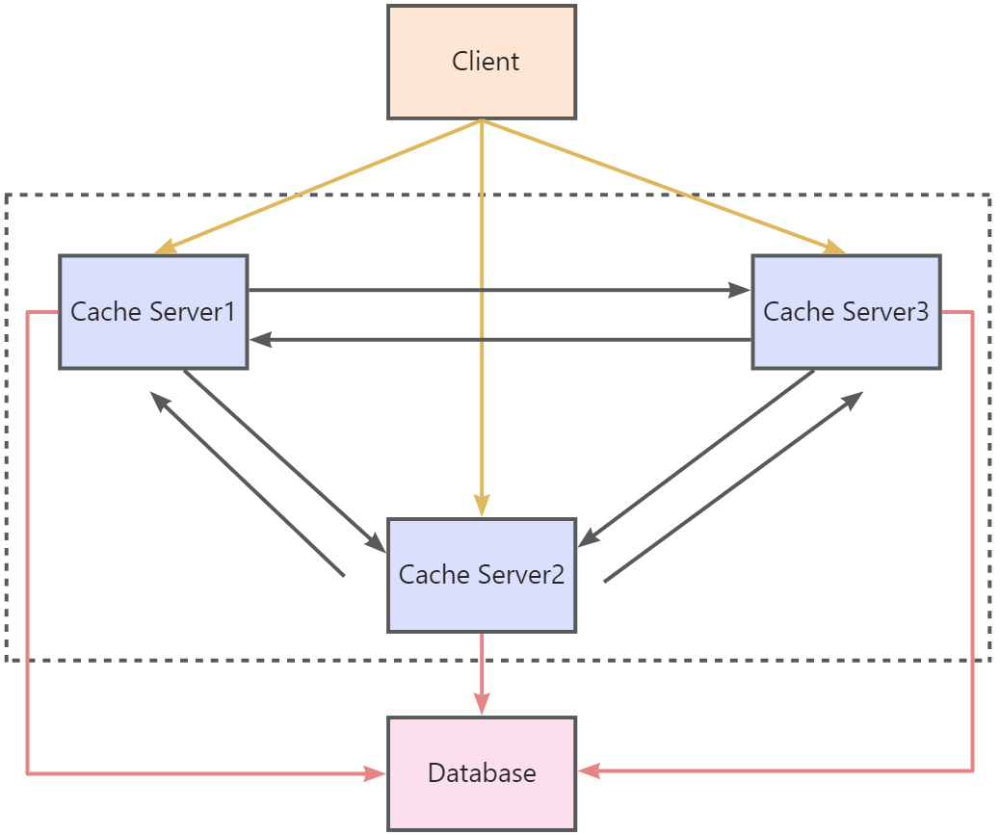
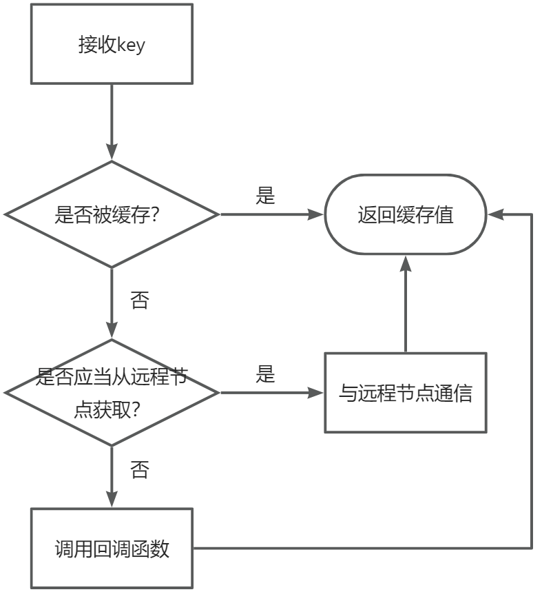
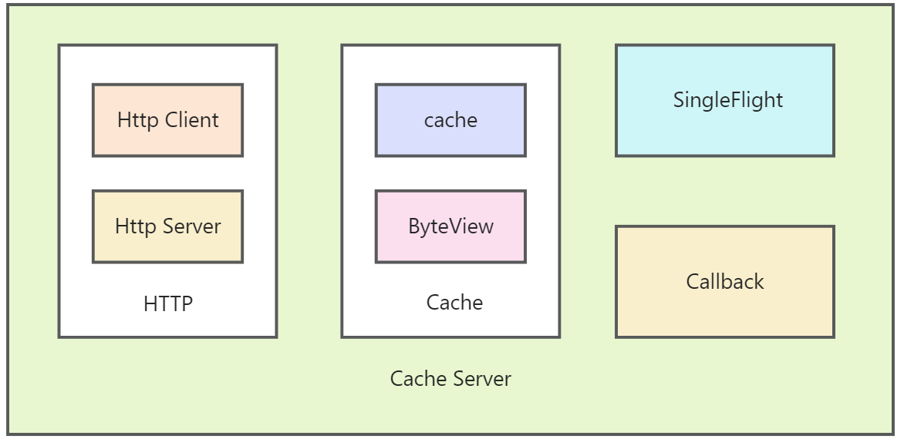
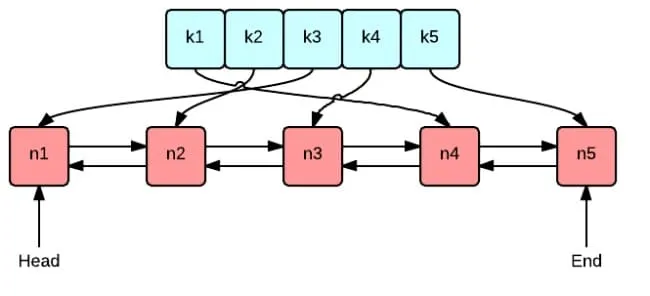

客户端向缓存节点cache server发起查询，缓存节点通过**一致性哈希**保证负载均衡，若目标缓存节点没有数据，则从数据库中读取，并更新缓存。支持**命名空间**。

项目架构图：

流程图：

cache server架构图：

**HTTP**：客户端请求哪个缓存节点是随机的，但是数据在哪个缓存节点是确定的（由**一致性哈希**确定），所以节点间需要通信，而通信需要服务端和客户端。使用go提供的**http库**实现。使用**protobuf**编解码，提高传输效率。

**SingleFlight**：防止**缓存击穿**。使用**sync.WaitGroup锁**避免重入，实现多次请求相同的key，只向远端节点或数据源发一次请求。

**Callback**：未找到缓存时，从数据库、文件...中获取数据，本项目不支持多数据源，由用户自定义**回调函数**实现获取数据。

**Cache**：用ByteView保存实际数据，LRU实现淘汰算法。实现LRU时未考虑**并发**问题，因此在外面包一层Cache，**加锁**来实现并发（因为get方法也涉及到对链表的修改，所以加的是Mutex而不是读写锁RWMutex）。

- **ByteView**：缓存的数据应该是**只读**的，不能被修改的。我们用byte存储数据，但是byte可能被外部程序修改，所以我们封装一个只读数据结构ByteView，要获取数据时每次返回的是一个**拷贝**。
- **cache**：缓存策略。缓存大小是有限制的，缓存满了要新增数据时要淘汰旧数据，这里实现了**LRU**和**LFU**算法进行淘汰。

以LRU为例，两个核心数据结构：

1. 绿色的是map，本项目通过键值对存储数据；map的值保存的是链表节点。
2. 红色的是链表，队首记录最近使用的，队尾是待淘汰的；链表节点中保存key，方便在map中删除对应键值对。